<h1 align="center">
 dbt-airflow-orchestrator</h1>
<h3>Data Pipeline Orchestration Tool for Airflow and dbt</h3>

## 📖 Table of Contents
- [📍 Overview](#-overview)
- [🔍 What It Does](#-what-it-does-and-how)
- [🔧 Code Structure](#-code-structure)
- [🛠️ Creating DAGs](#-creating-dags)
- [🧪 Testing Locally](#-testing-end-to-end-locally)

 

## 📍 Overview

This project is an data pipeline orchestration tool to generate Airflow DAGs based on data model dependencies across systems.

The base system is [dbt](https://github.com/dbt-labs/dbt-core), used in the Transformation layer, but this orchestrator can integrate the data lineage from the EL stage (i.e. Airbyte, Kafka Connect) to the visualization layer (i.e. Tableau).

Currently, this project will work better with a Snowflake data warehouse. Better support for other warehouses, plus integrations with other ETL and visualization tools, will be coming soon!

 

## 🔍 What It Does and How?

The dbt-airflow-orchestrator project generates full lineage DAGs that collect all required tables and sources together and produce a final target table.
This includes dbt models, data ingestion tools like Kafka Connect or Airbyte, and data sources included in data visualization tools (like Tableau extracts).

The project requries that the user defines a list of tables to generate DAGs for. This is done in a simple `.yaml` file, where the schedule and SLAs (minimum freshness of the data) are also defined.

It then reads the pre-generated dbt `manifest` file and uses this to determine the full lineage of the requested tables and to construct a DAG that contains all the dependencies of the target table. It generates these DAGs and then places them in the configured output directory.

A recommended use of this project is to run it in CICD and then output the generated DAGs to a location shared with Airflow (i.e. an S3 bucket), so that it can read the files and schedule the DAGs.

 

## 🔧 Code Structure

The entry point of the project is `main.py`. It collects the CLI params, reads the list of DAGs to orchestrate from a file and then triggers the lineage and dag generation.

The core of the project is `src/core/services/lineage_service.py`. Along with the classes it depends on, it reads the dbt manifest, generates the lineage and then builds the DAGs requested in the orchestration file.

The lineage service uses other components of the project, all inside the `src` directory. Each component includes files divided in three types: `entities`, `gateways`, and `services`. Generally, entities and gateways are needed for the services to function. Currently, the project components are the following:
- `core`: Apart from `lineage_service.py`, it includes other essential services and entities like `dag_generator.py` or `orchestration_config_parser.py`. Both `lineage_service.py` and `dag_generator.py` use the rest of the components.
- `dbt`: It includes entities and services for integrating Kafka Connect data sources into the generated DAGs.
- `airbyte`: It includes entities, gateways and services for integrating Airyte data sources into the generated DAGs.
- `kafkaconnect`: It includes entities, gateways and services for integrating Kafka Connect data sources into the generated DAGs.
- `tableau`: It includes entities, gateways and services for integrating Tableau data sources into the generated DAGs.

The project requires the user to create a `config.yaml` file at the root, following the example provided in `resources/config_template.yaml`, and add the appropiate credentials.

```mermaid
graph TD

    mainpy["main.py"]
    lineage_service_py["lineage_service.py"]

    titleCore("src/core") --> |contains| core
    titleDbt("src/dbt") --> |contains| dbt
    titleAirbyte("src/airbyte") --> |contains| airbyte
    titleKafkaConnect("src/kafkaconnect") --> |contains| kafkaconnect
    titleTableau("src/tableau") --> |contains| tableau

    subgraph core
        core_entities["entities"]
        core_gateways["gateways"]
        core_services["services"]
    end

    subgraph dbt
        dbt_entities["entities"]
        dbt_services["services"]
    end

    subgraph airbyte
        airbyte_entities["entities"]
        airbyte_gateways["gateways"]
        airbyte_services["services"]
    end

    subgraph kafkaconnect
        kafkaconnect_entities["entities"]
        kafkaconnect_gateways["gateways"]
        kafkaconnect_services["services"]
    end

    subgraph tableau
        tableau_entities["entities"]
        tableau_gateways["gateway"]
        tableau_services["services"]
    end

    mainpy --> lineage_service_py
    lineage_service_py --> core_services
    core_services -.-> core_entities
    core_services -.-> core_gateways
    core_services -.-> dbt_services
    core_services -.-> airbyte_services
    core_services -.-> kafkaconnect_services
    core_services -.-> tableau_services

    dbt_services -.-> dbt_entities
    airbyte_services -.-> airbyte_entities
    airbyte_services -.-> airbyte_gateways
    kafkaconnect_services -.-> kafkaconnect_entities
    kafkaconnect_services -.-> kafkaconnect_gateways
    tableau_services -.-> tableau_entities
    tableau_services -.-> tableau_gateways

    style mainpy fill:#f9f,stroke:#333,stroke-width:2px
    style lineage_service_py fill:#f9f,stroke:#333,stroke-width:2px
    style core_entities fill:#bbf,stroke:#333,stroke-width:2px
    style core_gateways fill:#bbf,stroke:#333,stroke-width:2px
    style core_services fill:#bbf,stroke:#333,stroke-width:2px
    style dbt_entities fill:#bbf,stroke:#333,stroke-width:2px
    style dbt_services fill:#bbf,stroke:#333,stroke-width:2px
    style airbyte_entities fill:#bbf,stroke:#333,stroke-width:2px
    style airbyte_gateways fill:#bbf,stroke:#333,stroke-width:2px
    style airbyte_services fill:#bbf,stroke:#333,stroke-width:2px
    style kafkaconnect_entities fill:#bbf,stroke:#333,stroke-width:2px
    style kafkaconnect_gateways fill:#bbf,stroke:#333,stroke-width:2px
    style kafkaconnect_services fill:#bbf,stroke:#333,stroke-width:2px
    style tableau_entities fill:#bbf,stroke:#333,stroke-width:2px
    style tableau_gateways fill:#bbf,stroke:#333,stroke-width:2px
    style tableau_services fill:#bbf,stroke:#333,stroke-width:2px
```

 

## 🛠️ Creating DAGs

### Requirements
- `python@3.9`
- `dbt-core >= 1.6`

This assumes you're comfortable with python and are already running a virtualenv for this project.

### Steps
1. Install dependencies: `pip install -r requirements.txt`
2. Generate DAGs: `python main.py -m <PATH_TO_DBT_MANIFEST_JSON>`

### Command Line Options
- `-c` Use cache - this is a faster way to run the project, instead of generated the lineage it will use a previously generated lineage and graph (stored in the lineage and graph .pickles) - this also does not require a manifest file.
- `-m` Path to dbt `manifest.json`, this is required if running without the cache option enabled but can be excluded otherwise.
- `-f` Path to orchestration file, the list of tables you'd like to orchestrate. If not specified, it defaults to `./resources/orchestration.yaml`.
- `-d` Path to a directory to output the generated DAGs to. If not specified, defaults to `./generated_dags/`, creating the directory if it doesn't exist.

 

## 🧪 Testing End to End Locally

Please refer to the README in the `local_testing` directory for instructions on how to run or test this project locally.

 

[**Return to Top**](#Top)